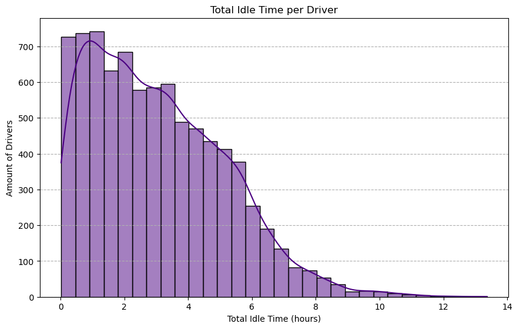
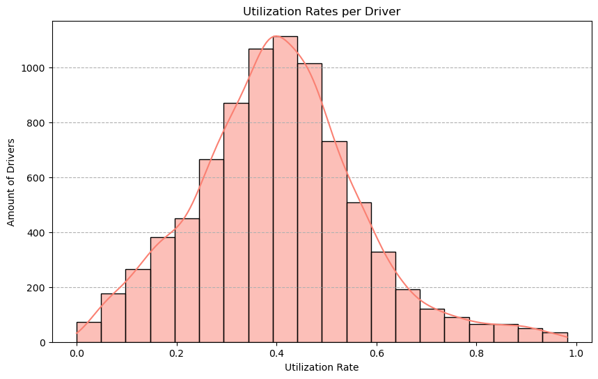

# BigData 2025: Project 1

Project [Big Data](https://courses.cs.ut.ee/2025/bdm/spring/Main/HomePage) is provided by [University of Tartu](https://courses.cs.ut.ee/).

Students: Kalju Jake Nekvasil, Joosep Orasmäe, Tanel Tiisler, Kaupo Humal

## Queries

### Query 0: Pre-processing

Pre-processing included: cleaning, transforming, and enriching the dataset. All the necessary pre-processing was done prior to any of the four queries in order to optimize each queries' performance.

#### Data Selection and Transformation

The first step in the pre-processing phase is removing all irrelevant fields (with respect to each of the queries) The `rides_df` DataFrame is created by selecting the medallion, driver id, pickup and drop off date/times, and the pickup and dropoff latitude/longitude coordinates columns. De-dimensionalizing the data reduces complexity, improving traversal speed and memory usage.

Next, the `unix_timestamp` function is used to convert the `pickup_datetime` and `dropoff_datetime` fields into Unix timestamps (milliseconds since the Unix epoch). This conversion is essential for performing time-based calculations, such as determining the duration of each ride. The duration is calculated by subtracting the `pickup_unix` timestamp from the `dropoff_unix` timestamp, resulting in a new column `duration_sec` that represents the ride duration in seconds.

#### Data Cleaning

The pre-processing phase includes several steps to clean the data and remove invalid or unrealistic entries. One such step involves identifying and removing rides where the pickup time is before the previous dro poff time for the same medallion (i.e., the same taxi). This is achieved using a window function (`Window.partitionBy("medallion").orderBy("pickup_unix")`) and the `lag` function to compare the current pickup time with the previous drop off time. Rides that violate this condition are filtered out, ensuring that the data reflects logical sequences of rides.

Further data cleaning is made by filtering out rides with negative durations or durations longer than four hours. This removes outliers and corrupted data points which could trigger errors or skew the final results of the four queries.

#### Geospatial Enrichment

Geospatial data is necessary to identify the boroughs for both pickup and drop off locations. The geospatial data is read from a GeoJSON file containing the geometry of each borough. We define multiple User-Defined Functions (UDF), one of which serializes the coordinates into Well-Known Text (WKT) format which allows us to calculate the area of each borough. This cleaned up geospatial data is then used to identify the borough given a pickup or drop off point.

The `coords_to_point_udf` UDF converts the latitude and longitude coordinates into WKT point representations. The UDF, `find_borough_udf`, is used to determine the borough for each point by checking if the point lies within the polygon of any borough. Rides with pickup or drop off points outside of NYC (i.e., those with "N/A" borough values) are then filtered out.

#### Optimizations

Window functions reduce compute overhead by handling time-based conditionals on-the-fly for partitioning or ordering operations which significantly improves performance and scalability.

Since the geospatial data is relatively small compared to the rides dataset, we broadcast the borough lookup to all nodes in the cluster. This acts as a cache, saving the data transfer bandwidth between nodes and improving lookup time.

We also cached the `rides_df` dataset after the pre-processing steps to speed up lookup and compute for the four later queries. Just like broadcasting, caching increases lookup speed, which improves query speed.

### Query 1: Utilization Rate

Query 1 calculates the **utilization rate per driver**, which measures the proportion of time drivers spend on active rides versus idle time.

The query begins by calculating the idle time for each driver (the time spent waiting between dropping off one passenger and picking up the next). The dataset is first partitioned by driver ID (`hack_license`) and ordered by pickup time (`pickup_unix`) which importantly maintains chronological order. The idle time is calculated as the difference between the current pickup time and the previous drop off time (`pickup_unix - prev_dropoff`). However, if this difference exceeds a 4 hours (`DRIVER_SESSION_LENGTH`), the row's idle time is set to 0 and later removed. This value is then stored in the new column, `idle_time_sec`, grouped by driver ID, and summed, returning the total idle time for each driver.

Next, the query calculates the active time for each driver (the total time spent actively driving passengers). This is calculated by summing the duration of all rides (`duration_sec`) for each driver. The resulting DataFrame, `active_time_df`, contains the total active time per driver. The `active_time_df` and `idle_time_df` DataFrames are joined on the driver ID (`hack_license`) to create a combined DataFrame, `driver_times_df`.

Finally, the query calculates the utilization rate as the ratio of active time to the total session time (active time + idle time) for each driver. This utilization rate shows how much of a driver's working time is spent actively driving passengers versus waiting for the next ride. These values are stored in the new DataFrame, `utilization_df`.

Window functions (`Window.partitionBy("hack_license").orderBy("pickup_unix")`) were used in Query 1 to efficiently calculate each driver's idle time. This saved removed the need for any standalone operations which would increase overhead compute.

### Query 2: Average Time to Find Next Fare per Destination Borough

Query 2 calculates the **average time until the next fare by dropoff borough**. Much of the heavy lifting (geospacial and data cleaning) was already done in the pre-processing phase, making the query relatively straightforward.

The query begins by using a window function to partition the data by driver ID (`hack_license`) on-the-fly and order it by pickup time (`pickup_unix`) to maintain chronological order. The column `next_pickup_unix` is created using the `lead()` function, which retrieves the pickup time of the next ride for the same driver. This allows the calculation of the time between the current dropoff and the next pickup (`next_fare_time`). If there is no next ride (i.e., `next_pickup_unix` is null) or `next_fare_time` is longer than 4 hours, the row is filtered out.

Once the `next_fare_time` is calculated, the DataFrame `avg_next_fare_by_borough` is created by grouping the data by `dropoff_borough` and calculating the average `next_fare_time` for each borough. This results in a table with average time until the next fare for each borough.

|`dropoff_borough`|`avg_next_fare_time_sec`|
|---------------|----------------------|
|      Manhattan|     857.09 seconds|
|       Brooklyn|    1942.48 seconds|
|          Bronx|    2081.31 seconds|
|         Queens|    2617.98 seconds|
|  Staten Island|    4350.00 seconds|

---

### Query 3: Trips Starting and Ending Within the Same Borough

Query 3 calculates the **number of trips that started and ended within the same borough**.
The query begins by filtering the pre-processed `rides_df` DataFrame to only include trips where the `pickup_borough` matches the `dropoff_borough` (or `col("pickup_borough") == col("dropoff_borough")`). The resulting DataFrame, `same_borough_trips`, contains all trips that start and end within the same borough. We then use the  `count()` function on the `same_borough_trips` DataFrame to find the total number of trips.

This query is much simpler than the previous queries because the majority of the work was already completed within the pre-processing phase. Specifically implementation of the UDF `ind_borough_udf()` which finds the borough given a geospacial point within the `rides_df` DataFrame.

---

### Query 4: Trips Between Different Boroughs

Query 4 calculates the **number of trips that started in one borough and ended in another**. It builds on Query 3 by subtracting the number of intra-borough trips (`total_same_borough`) from the total number of trips (`rides_df.count()`). This provides the count of inter-borough trips without additional filtering or transformations.

The query is made efficient by relying on the pre-processed data process and reusing results from Query 3.

## Requirements

Build the project container:

`$ docker compose up --build`

The Jupyter Notebook is accessible on port 8888
The Spark UI is accessible on port 4040
